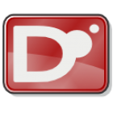

# The D Programming Language

##A new take on C++

- Presented by Matthew Soucy
- msoucy@csh.rit.edu

---

# What is D?

## "Great, the last thing I need is another D in programming!" - Walter Bright

- Developed by:
    - Walter Bright (Digital Mars, first native C++ compiler)
    - Andrei Alexandrescu (_Modern C++ Design_, Facebook)
    - Many contributors (Phobos standard library)
- Designed to be "C++ Done Right"
- Compiles to native code
- Community driven, multi-paradigm, buzzword-filled (but in a good way!)

---

# Five instantly-useful features

Built-in associative arrays:

    !d
    int[string] x;

Garbage collection, unless you want manual memory management, in which case it's fine.

Arrays know their length.

Compile time is insanely short.

Object-oriented, but only when you want it.